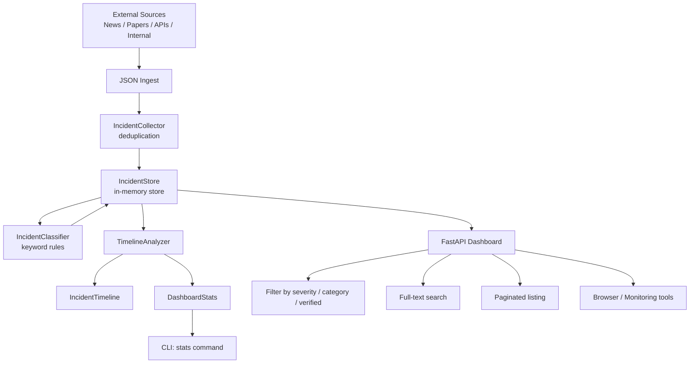

# aumai-opensafety

**Aggregator for AI safety incidents and near-misses.**

Part of the [AumAI](https://github.com/aumai) open-source infrastructure suite for agentic AI systems.

[](https://github.com/aumai/aumai-opensafety/actions)
[](https://pypi.org/project/aumai-opensafety/)
[](LICENSE)
[](https://www.python.org/)

---

## What is this?

Think of the aviation industry. Every time a plane has a near-miss, a bird strike, or a
system malfunction — even when nothing goes wrong — pilots and crews are required to file
detailed incident reports. These reports flow into centralized databases that safety
analysts use to find patterns, identify systemic risks, and prevent future accidents.
The insight that prevented a dozen crashes often came from studying ten near-misses.

`aumai-opensafety` does the same thing for AI systems. When an AI model hallucinates a
dangerous medical recommendation, when a jailbreak bypasses a safety filter, when a
language model leaks private training data — these are AI safety incidents. Today they
are scattered across news articles, research papers, social media posts, and internal
post-mortems. `aumai-opensafety` provides the infrastructure to collect them all in one
place, classify them, analyze trends over time, and serve them through a dashboard API.

---

## Why does this matter?

### The problem from first principles

AI systems are being deployed into high-stakes domains at a pace that outstrips our
ability to understand what goes wrong. There is no centralized, structured, queryable
database of AI safety incidents that a practitioner can use to answer questions like:

- "How often do safety bypasses occur in production LLM deployments?"
- "Is the rate of hallucination incidents increasing or decreasing over the past 6
  months?"
- "Which AI systems are most frequently associated with bias incidents?"

Without answers to these questions, AI safety is reactive rather than proactive. Teams
respond to incidents they experience themselves, but they cannot learn from incidents
experienced by others.

### Why an open infrastructure library?

Most organizations building AI safety tracking tools start from scratch — bespoke
databases, ad-hoc classification, no shared vocabulary. `aumai-opensafety` provides a
reusable foundation: shared data models, keyword-based auto-classification, deduplication,
temporal analysis, and a FastAPI dashboard. Organizations can build on it rather than
re-inventing it.

---

## Architecture



---

## Features

| Feature | Description |
|---|---|
| Structured incident model | `SafetyIncident` is a validated Pydantic model with severity, category, source, affected systems, and tags |
| Keyword auto-classification | `IncidentClassifier` infers severity and category from title + description text using configurable keyword tables |
| Deduplication | `IncidentCollector` silently ignores duplicate incident IDs during bulk import |
| In-memory store with rich queries | `IncidentStore` supports filter by severity, category, verification status, full-text search, and pagination |
| Temporal analysis | `TimelineAnalyzer` builds sorted timelines, counts incidents per day, identifies trending categories over rolling windows |
| Dashboard statistics | `DashboardStats` aggregates totals, breakdowns by severity and category, 30-day trend data |
| FastAPI dashboard server | `serve` command launches a REST API for browsing incidents |
| CLI tools | `ingest`, `stats`, and `serve` commands for operational workflows |
| Severity levels | `critical`, `high`, `medium`, `low`, `informational` |
| Incident categories | `model_failure`, `data_leak`, `bias`, `misuse`, `safety_bypass`, `hallucination`, `other` |

---

## Quick Start

**Requirements:** Python 3.11+

```bash
# Install
pip install aumai-opensafety

# Install with server support
pip install "aumai-opensafety[server]"

# Ingest a JSON file of incidents and view a severity breakdown
opensafety ingest --file incidents.json

# Show dashboard statistics from a file
opensafety stats --file incidents.json

# Start the dashboard API server
opensafety serve --port 8000 --seed incidents.json
```

**Example incidents.json:**

```json
[
  {
    "incident_id": "INC-001",
    "title": "LLM jailbreak bypasses safety filter",
    "description": "A prompt injection technique circumvented guardrails in production deployment.",
    "severity": "high",
    "category": "safety_bypass",
    "source": "https://example.com/report",
    "reported_date": "2025-01-10T12:00:00Z",
    "affected_systems": ["gpt-4-production"],
    "tags": ["jailbreak", "prompt-injection"],
    "verified": true
  }
]
```

**Example output from `opensafety stats`:**

```
Total incidents : 127
Verified        : 89
Unverified      : 38

By severity:
  critical       : 12
  high           : 41
  medium         : 58
  low            : 16

By category:
  hallucination       : 34
  safety_bypass       : 28
  bias                : 21
  misuse              : 19
  model_failure       : 15
  data_leak           : 7
  other               : 3
```

---

## CLI Reference

### `opensafety ingest`

Import incidents from a JSON file, with optional auto-classification.

```
Usage: opensafety ingest [OPTIONS]

Options:
  --file PATH          JSON file containing an array of incident objects.
                       [required]
  --auto-classify      Auto-classify severity and category using keyword
                       rules. Overwrites existing severity/category fields.
  --help               Show this message and exit.
```

**Examples:**

```bash
# Basic ingest — severity and category from the file
opensafety ingest --file incidents.json

# Ingest and let the classifier set severity + category from the text
opensafety ingest --file incidents.json --auto-classify
```

**Output:**

```
Ingested 42 new incidents from incidents.json
  critical       : 5
  high           : 14
  informational  : 3
  low            : 8
  medium         : 12
```

---

### `opensafety stats`

Print aggregated dashboard statistics from a JSON incident file.

```
Usage: opensafety stats [OPTIONS]

Options:
  --file PATH          JSON file to read incidents from. [required]
  --help               Show this message and exit.
```

**Example:**

```bash
opensafety stats --file incidents.json
```

---

### `opensafety serve`

Start the FastAPI incident dashboard server.

```
Usage: opensafety serve [OPTIONS]

Options:
  --port INTEGER       HTTP port. [default: 8000]
  --host TEXT          Bind host. [default: 0.0.0.0]
  --seed PATH          JSON file with initial incidents to load on startup.
  --help               Show this message and exit.
```

**Examples:**

```bash
# Start on default port with seed data
opensafety serve --seed incidents.json

# Bind to localhost only on a custom port
opensafety serve --host 127.0.0.1 --port 9000

# Production with seed data
opensafety serve --host 0.0.0.0 --port 8080 --seed /data/incidents.json
```

Once running, the API is available at `http://localhost:8000`. See the FastAPI
auto-generated docs at `http://localhost:8000/docs`.

---

## Python API

### Collecting and importing incidents

```python
from aumai_opensafety.core import IncidentCollector
from aumai_opensafety.models import SafetyIncident, IncidentSeverity, IncidentCategory
from datetime import datetime, UTC

collector = IncidentCollector()

# Add a single incident
incident = SafetyIncident(
    incident_id="INC-001",
    title="Hallucination in medical advice system",
    description="Model fabricated a drug dosage recommendation that could cause harm.",
    severity=IncidentSeverity.critical,
    category=IncidentCategory.hallucination,
    source="https://example.com/report-001",
    reported_date=datetime(2025, 1, 15, tzinfo=UTC),
    affected_systems=["medai-v2"],
    tags=["medical", "hallucination", "patient-safety"],
    verified=True,
)
is_new = collector.add(incident)
print(f"Added: {is_new}")  # True if new, False if duplicate

# Bulk import from a list
count = collector.bulk_import([incident1, incident2, incident3])
print(f"Newly added: {count}")

# Import directly from JSON dicts
import json
raw = json.loads(open("incidents.json").read())
count = collector.bulk_import_json(raw)

print(f"Total incidents: {collector.count}")
all_incidents = collector.all_incidents()
```

### Storing and querying incidents

```python
from aumai_opensafety.core import IncidentStore

store = IncidentStore()
for incident in collector.all_incidents():
    store.add(incident)

# Retrieve by ID
inc = store.get("INC-001")

# Filter queries
critical = store.filter_by_severity(IncidentSeverity.critical)
jailbreaks = store.filter_by_category(IncidentCategory.safety_bypass)
verified = store.filter_verified(verified=True)

# Full-text search across title, description, and tags
results = store.search("prompt injection")

# Paginated listing with filters
page_items, total = store.paginate(
    page=1,
    page_size=20,
    severity=IncidentSeverity.high,
    verified=True,
)
print(f"Page 1 of {total // 20 + 1} ({total} total matching)")
```

### Auto-classifying incidents

```python
from aumai_opensafety.core import IncidentClassifier

classifier = IncidentClassifier()

# Classify severity from text
severity = classifier.classify_severity(incident)
print(severity)  # IncidentSeverity.critical (matched "catastrophic" keyword)

# Classify category from text
category = classifier.classify_category(incident)
print(category)  # IncidentCategory.hallucination (matched "fabricated" keyword)

# Return a new incident with both fields auto-set
reclassified = classifier.reclassify(incident)
# Original incident is unchanged (Pydantic model_copy)
```

### Temporal analysis

```python
from aumai_opensafety.core import TimelineAnalyzer

analyzer = TimelineAnalyzer()
incidents = store.all()

# Build a sorted timeline with summary stats
timeline = analyzer.build_timeline(incidents)
print(f"Period: {timeline.period_description}")
print(f"Earliest: {timeline.earliest_date}")
print(f"Latest: {timeline.latest_date}")
for inc in timeline.sorted_incidents():
    print(f"  {inc.reported_date.date()} — {inc.title}")

# Count incidents per calendar day
daily_counts = analyzer.incidents_per_day(incidents)
for date, count in daily_counts.items():
    print(f"  {date}: {count} incidents")

# Trending categories in the last 30 days
trending = analyzer.trending_categories(incidents, days=30)
for category_name, count in trending:
    print(f"  {category_name}: {count}")

# Full dashboard statistics
stats = analyzer.build_dashboard_stats(incidents)
print(f"Total: {stats.total_incidents}")
print(f"By severity: {stats.by_severity}")
print(f"30-day trend: {stats.trend_30d}")
```

---

## Configuration Options

| Parameter | CLI flag | Default | Description |
|---|---|---|---|
| Server port | `serve --port` | `8000` | HTTP port for the dashboard API |
| Server host | `serve --host` | `0.0.0.0` | Bind address for the server |
| Seed file | `serve --seed` | (none) | JSON file loaded on server startup |
| Auto-classify | `ingest --auto-classify` | false | Apply keyword classifier during ingest |
| Input file | `ingest --file` / `stats --file` | (none) | JSON incident file to read |

The keyword tables used by `IncidentClassifier` are defined in `core.py`. To use custom
keywords, subclass `IncidentClassifier` and override the `_SEVERITY_KEYWORDS` and
`_CATEGORY_KEYWORDS` module-level dicts, or implement your own classifier that calls
`reclassify()`.

---

## How it works — Technical Deep-Dive

### Incident classification

`IncidentClassifier` uses module-level keyword tables (`_SEVERITY_KEYWORDS` and
`_CATEGORY_KEYWORDS`) that map each `IncidentSeverity` and `IncidentCategory` enum value
to a list of keyword strings. Classification evaluates the concatenation of `title` and
`description` (lowercased) and walks the enum values in priority order, returning the
first match. This means "critical" trumps "high" even if both keywords appear in the
text.

The severity priority order is: `critical > high > medium > low > informational`.
Unmatched text defaults to `informational` for severity and `other` for category.

### Deduplication

`IncidentCollector.add()` uses `incident_id` as the deduplication key. Calling `add()`
with an already-seen ID returns `False` and leaves the store unchanged. `bulk_import()`
returns only the count of _newly added_ incidents, making it safe to call repeatedly
with overlapping feeds.

### In-memory store and pagination

`IncidentStore` is backed by a plain Python dict keyed by `incident_id`. The `paginate()`
method applies all optional filters first, then sorts by `reported_date` descending
(newest first), then slices to the requested page. This is appropriate for datasets up
to tens of thousands of incidents; for larger collections, replace with a database-backed
store.

### Timeline and trend analysis

`TimelineAnalyzer.build_timeline()` sorts incidents by `reported_date` and computes the
date range span. `trending_categories()` applies a rolling time window cutoff using
`datetime.now(UTC) - timedelta(days=N)` and returns a `Counter` of category values for
incidents within that window, sorted by count descending. The 30-day trend in
`build_dashboard_stats()` is a list of `{"date": "YYYY-MM-DD", "count": N}` dicts,
suitable for direct rendering in a line chart.

---

## Integration with other AumAI projects

- **aumai-agentcve**: CVE disclosures affecting AI agent frameworks are a category of
  safety incident. Export vulnerability reports from `agentcve` and import them into
  `opensafety` as `IncidentCategory.model_failure` or `data_leak` incidents for
  longitudinal tracking.
- **aumai-specs**: Use `opensafety` incident data to inform spec validation rules. If
  hallucination incidents are trending up in a particular domain, tighten the validation
  specs for outputs from agents in that domain.
- **aumai-protocolbridge**: Protocol translation failures or unexpected message
  transformations that affect safety properties should be logged as `IncidentCategory.
  model_failure` incidents in `opensafety`.

---

## Contributing

1. Fork the repository
2. Create a feature branch: `git checkout -b feature/my-improvement`
3. Run the test suite: `make test`
4. Run linting: `make lint` (ruff + mypy strict)
5. All new code requires type hints; no `Any` without justification
6. Conventional commit messages: `feat:`, `fix:`, `refactor:`, `docs:`, `test:`, `chore:`

---

## License

Apache License 2.0. See `LICENSE` for the full text.

```
Copyright 2025 AumAI Contributors

Licensed under the Apache License, Version 2.0 (the "License");
you may not use this file except in compliance with the License.
You may obtain a copy of the License at

    http://www.apache.org/licenses/LICENSE-2.0
```
